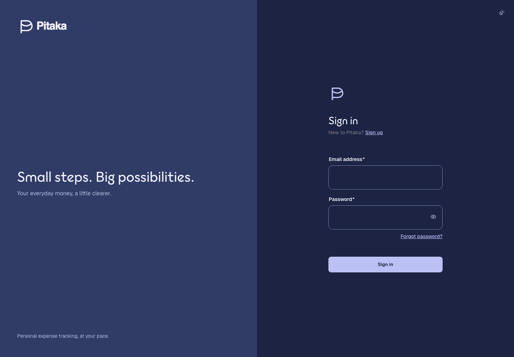

# Issue 231 validation

Validated 2026-09-21 against the development application.

## Automated coverage

- `Theming` covers missing/invalid preference fallback, live System following,
  fixed overrides, failed-save in-tab behavior, and cross-tab storage changes
  without passive write-back.
- `DialogShell` covers untouched close, dirty confirmation with safe initial
  focus, pending dismissal blocking, Escape, and labelled close control.
- New Account and sign-in rendered tests cover enabled invalid Submit, touched
  error presentation, first-invalid-field focus, and duplicate prevention.
- `Session` covers protected-overlay cleanup, private-state clearing, preserved
  return destination, and the explicit expiry/draft-loss notice.
- The full Angular test suite, changed-file checks, formatting, lint, and
  production build are the completion gates recorded in the implementing
  commit.

## Browser evidence

Installed Chrome was run against the real development server at 1440 × 1000.
The first visit followed the host's dark preference before Angular rendered and
showed the production Pocket p lockup, branded desktop composition, Outfit / Geist
roles, curated surfaces, full field outlines, appearance control, and enabled
invalid Submit.

## Limits requiring user review

- This environment exposed no controllable interactive browser, so the saved
  Light override and menu interaction were verified through rendered component
  tests and theme state/DOM tests rather than a second screenshot.
- Headless Chrome on this host enforced a 500px layout viewport when asked for a
  390px bitmap. That capture was discarded rather than presented as phone
  evidence. The responsive templates and 44px targets compile and are covered
  structurally, but a genuine 320/390px browser and actual 400% zoom still need
  visual user review.
- No screen-reader application was available. Roles, live regions, labels,
  focus movement, Escape behavior, and restoration are automated; an actual
  screen-reader pass remains manual.
- API-backed financial workflows could not be exercised because no Pitaka API
  was available in this environment. Existing adapter and lifecycle tests stayed
  green, including fresh-read balance behavior.
