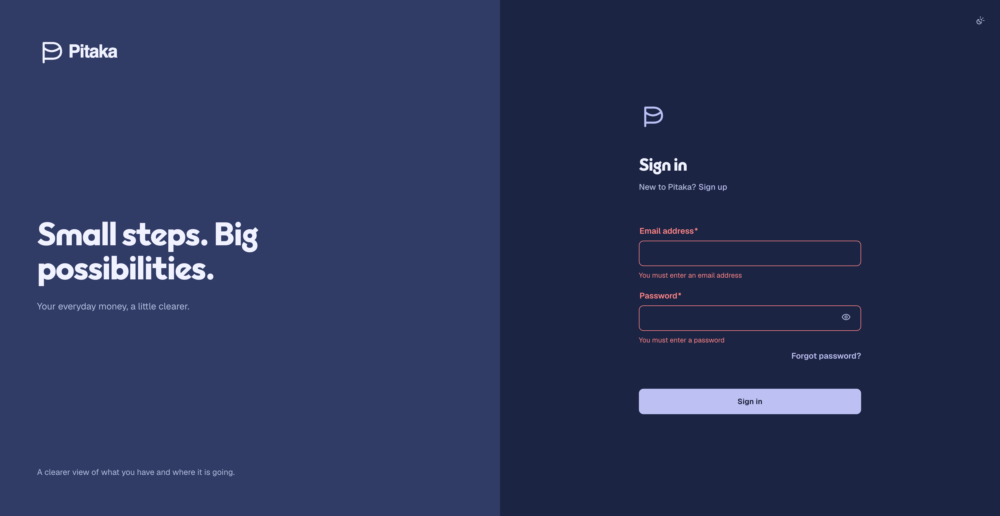

# Issue 242 verification

Verified 2026-09-24 against the sign-in route in the development application.

## Implemented behavior

- Sign-in uses the approved desktop brand panel and form composition, with a
  focused phone card. The card remains scrollable at high zoom.
- The screen follows the Pocket p / Pitaka identity, Outfit heading and Geist
  interface roles, and the approved scheme-aware surface and feedback tokens.
- Appearance is available from the shared auth layout. Its System, Light, and
  Dark choices expose the selected preference as radio menu items.
- Invalid Submit stays enabled, reveals touched errors, focuses the first
  invalid field, and sends no request. The password reveal control has a
  changing accessible name and a 44px target.
- Pending sign-in announces progress, disables Submit, and ignores repeated
  submissions. Existing error, unconfirmed-email, locked-out, session-expiry,
  and safe return-destination behavior remains covered.

## Automated verification

- Sign-in component suite: 18 tests passed.
- Auth routes suite: 6 tests passed.
- Full application suite: 1,061 tests passed across 79 files.
- `npm run build`, `npm run lint`, `npm run check:format`, and
  `npm run check:changed -- --base origin/main`: passed.

## Browser review

- Reviewed the actual sign-in route in Light and System/Dark, including the
  desktop split and focused phone card. The stored screenshot shows Dark
  validation feedback; the Light view was inspected in the browser but was not
  saved as a separate image.
- At 400% browser zoom, the brand panel collapsed, the card fit the viewport
  width, and the form remained reachable by vertical scrolling without
  horizontal clipping. Browser zoom was restored to 100% afterward.
- Keyboard traversal reached Email, Password, Show password, Forgot password,
  and Sign in. The appearance menu reported System as selected; Escape returned
  focus to its trigger. Password reveal changed the control name to Hide
  password and back.
- An empty submission showed both field errors and focused Email. The
  automation suite covers wrong credentials, locked-out and unconfirmed
  Profiles, server failures, session-expiry notice, and return destinations.

## Limits

- No live API credentials were available for a successful sign-in, so the
  browser workflow stopped at validation. Auth server outcomes are covered by
  component tests using service stubs.
- A manual screen-reader session and runtime contrast measurements across all
  rendered focus and hover states were not available in this review.
